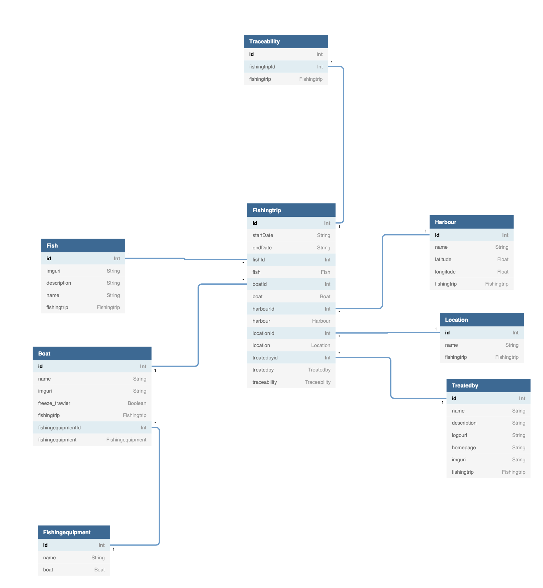

# Wise Traceability
## About
This project was developed for WiseFish as a final project autumn 2021.
The aim of the project is to allow consumer to see the origin of their fheir fish. The packaging for each fish is supposed to have a QR code which will redirect the user to the fishing trip site for which is what it was caught. The fishingtrip site will show users the following information:
- What fish was caught
- Information about the fish
- What boat caught the fish 
- Information about the boat like: name, owner, and start date and end date of the tour
- Where this fish was landed, on a map
- Information about the company that treated the fish
- Recipies with said fish


# Authors

- Björn Johnson (bjornj20@ru.is)
- Vésteinn Bjarnason (vesteinn19@ru.is)
- Ýmir Páll Gíslason (ymir17@ru.is)

Every author was a student at Reykjavík University in the Computer Science department during the development process.


# Running the frontend
1. Start by running  `npm install` in the traceability folder
2. run `npm run`

This will run the frontend at localhost:3000
The frontend will communicate the backend since that backend is already depolyed.

# FrontEnd
## Technologies
- TypeScript
- GraphQL
- React

The front-end is a react typescript website and is hosted at [Heroku](https://wise-frontend.herokuapp.com)

# BackEnd
## Running the backend locally
Note that to run the backend locally you need to set up your own postgres server locally and connect the Prisma client to it. 
This is a bit of a hassell and isn't recommended.

## Technologies
- PostgreSQL
- Prisma
- GraphQL
## Database
The database is a postgres database made with Prisma and GraphQL and is hosted at [Heroku](https://wise-trace.herokuapp.com/api). 

### Database Schema


## API
The GraphQL API supports GET and UPDATE queries for all the entities in our DB. 
However it is important to understand that the front-end of the application isn't suppose to be able to create or update the entries in the database. However it would probably be smart to implement that for potential customers in the future, so that they can easiliy create new or update existing entries in the database. That wasn't in the scope of the project but could be implemented later down the down the line.
The following tables are in our database:

##  Traceability:
```
id: int
fishingtripiD: int
```
  

## Traceability Queries and Mutations
**Get specific traceability**
```
query{
    traceability(id:int)
    {
        id
        fishingtripId
    }
}
```
**Get all traceabilites**
```
query{
    traceabilities
    {
        id
        fishingtripId
    }
}
```
**Create Traceability** note that there is a foreign key constraint on fishingtripId. So to be able to create a new traceability there must already be one in the database. 
```
mutation{
    createTraceability(id:int, fishingtripId:int)
    {
        id
        fishingtripId
    }
}
```
**Update Traceability** has **not been implemented.** 


## Fishingtrip
```
id: int
startDate: string
endDate:string
fishId: int
boatId: int
harbourId: int
locationId: int
treatedbyid: int
```
## Fishingtrip Queries
**Get specific fishingtrip**
```
query{
    fishingtrips(id:int)
    {
        id
        startDate
        endDate
        fishId
        boatId
        harbourId
        locationId
        treatedbyid
    }
}
```
**Get all fishingtrips**
```
query{
    fishingtrips
    {
        id
        startDate
        endDate
        fishId
        boatId
        harbourId
        locationId
        treatedbyid
    }
}
```
**Create Fishingtrip** for creating a fishingtrip there are a couple of things to note
- This table relies on alot of relations and they will be listed below.
- Each of these relations must already exist so that the user can create a fishingtrip

**The Foreign key constraints for fishingtrips are:**
1. fishId - This references a valid Fish in the Fish table
2. boatId - This references a valid Boat in the Boat table
3. harbourId - this references a valid Harbour in the Harbour table
4. locationId - This references a valid Location in the Location table
5. treatedbyId - This references a valid TreatedBy in the TreatedBy table

```
mutation{
    createFishingtrip(
        startDate: string
        endDate: string
        fishId: int
        boatId: int
        harbourId: int
        locationId: int
        treatedbyid: int
    )
    {
        id
        startDate
        endDate
        fishId
        boatId
        harbourId
        locationId
        treatedbyid
    }
}
```
**Update Fishingtrip has not yet been implement**


##  Harbour 
```
id: int
name: string
latitude: float
longitude: float
```

## Harbour Queries and mutations
**Get specific harbour**
```
query{
    harbour(id:int)
    {
        id
        name
        latitude
        longitude
    }
}
```
**Get all harbours**
```
query{
    harbours
    {
        id
        name
        latitude
        longitude
    }
}
```

**Create harbour**
```
mutation {
    harbour(
        name: string
        latitude: float
        longitude: float
        )
    {
        id
        name
        latitude
        longitude
    }
}
```

**Update harbour** note that for all the update mutations the use must reference an already existing entity in the database to update.
```
mutation {
    updateHarbour(
        id:int
        name: string
        latitude: float
        longitude: float
        )
    {
        id
        name
        latitude
        longitude
    }
}
```


## Fish 
```
id: int
name: string
imguri: string
description: string
```

## Fish Queries and Mutations

**Get specific fish**
```
query{
    fish(id:int)
    {
        id
        name
        imguri
        description
    }
}
```
**Get all fishes**
```
query{
    fishes
    {
        id
        name
        imguri
        description
    }
}
```

**Create Fish**
```
mutation{
    createFish(
            name:string
            imguri:string
            description:string
        )
    {
        id
        name
        imguri
        description
    }
}
```

**Update Fish**
```
mutation{
    updateFish(
            int:id
            name:string
            imguri:string
            description:string
        )
    {
        id
        name
        imguri
        description
    }
}
```
## Location
```
id: int
name: string

```

## Location Queries and Mutations
**Get specific location**
```
query{
    location(id:int)
    {
        id
        name
    }
}
```
**Get all locations**
```
query{
    locations
    {
        id
        name
    }
}
```
**Create Location**
```
mutation{
    createLocation(name:string)
    {
        id
        name
    }
}
```

**Update Location**
```
mutation{
    updateLocation
    (
        id: int
        name:string
    )
    {
        id
        name
    }
}
```


## Boat
```
id: int
name: string
imguri: string
freeze_trawler: boolean
fishingequipmentId: int
```

## Boat Queries and Mutations
**Get specific boat**
```
query{
    boat(id:int)
    {
        id
        name
        imguri
        freeze_trawler
        fishingequipmentId
    }
}
```
**Get all boats**
```
query{
    boats
    {
        id
        name
        imguri
        freeze_trawler
        fishingequipmentId
    }
}
```

**Create Boat** - There is one foreign key constraint to be aware of when creating a boat and that is FishingEquipment. In order to create a boat an existing you must use the fishingequipmentId to reference an existing  FishingEquipment. 
```
mutation{
    createBoat
    (
        name:string
        imguri: string
        freeze_trawler: boolean
        fishingeuipmentId: int
    )
    {
        id
        name
        imguri
        freeze_trawler
        fishingequipmentId
    }
}
```

**Update Boat** - Same foreign key constraint here as above. It is also mandatory that the id references an existing Boat.
```
mutation{
    updateBoat
    (
        id: int
        name:string
        imguri: string
        freeze_trawler: boolean
        fishingeuipmentId: int
    )
    {
        id
        name
        imguri
        freeze_trawler
        fishingequipmentId
    }
}
```


## TreatedBy
```
id: int
name: string
imguri: string
logouri: string
homepage: string
```

## Treatedby Queries and Mutations
**Get specific treatedby**
```
query{
    treatedby(id:int)
    {
        id
        name
        imguri
        logouri
        homepage
    }
}
```
**Get all treatedby**
```
query{
    treatedbys
    {
        id
        name
        imguri
        logouri
        homepage
    }
}
```

**Create treatedby**
```
mutation{
    createTreatedBy
    (
        name: string
        imguri: string
        logouri: string
        homepage: string
    )
    {
        id
        name
        imguri
        logouri
        homepage
    }
}
```

**Update treatedby**
```
mutation{
    updateTreatedBy
    (
        id: int
        name: string
        imguri: string
        logouri: string
        homepage: string
    )
    {
        id
        name
        imguri
        logouri
        homepage
    }
}
```

## FishingEquipment
```
id: int
name: string
```

## FishningEquipment Queries and Mutations
**Get a specific fishingequipment**
```
query{
    fishingequipment(id:int)
    {
        id
        name
    }
}
```
**Get all fishingequipments**
```
query{
    fishingequipment(id:int)
    {
        id
        name
    }
}
```
**Create fishingequipment**
```
mutation{
    fishingequipment(name:string)
    {
        id
        name
    }
}
```

**Update fishingequipment**
```
mutation{
    fishingequipment
    (
        id:int 
        name:string
    )
    {
        id
        name
    }
}
```


